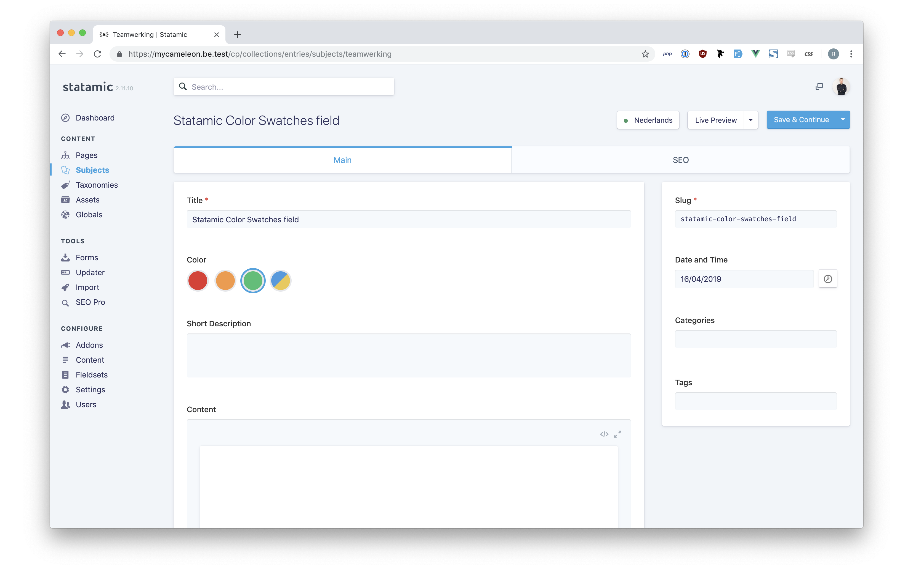

[](https://github.com/rias500/statamic-color-swatches/releases)
[](https://scrutinizer-ci.com/g/rias500/statamic-color-swatches)
[](https://styleci.io/repos/117454863)
[](https://packagist.org/packages/rias/statamic-color-swatches)

# Color Swatches plugin for Statamic

Let clients choose from a predefined set of colours.



## Installation

To install the plugin, download the plugin and place it in your `site/addons` folder.

## Color Swatches Overview

Instead of providing a user a full color picker, Color Swatches gives an admin the ability to provide a selection of colors for a user to choose from.

## Using Color Swatches

Add the fieldtype to your fieldset, you can define multiple colors for a swatch by using a YAML array. You can also set a default color by entering the label.

```yaml
sections:
  main:
    display: Main
    fields:
      color:
        type: color_swatches
        colors:
          red: '#E3342F'
          orange: '#F6993F'
          green: '#38C172'
          blue-yellow:
            - '#4299E1'
            - '#ECC94B'
        default: blue
```

## Using Color Swatches

You can access both the label and color in your template.

```twig
{{ color.label }}
{{ color.value }}
{{ color.value[0] }} #If it's more than one color
```

Brought to you by [Rias](https://rias.be)